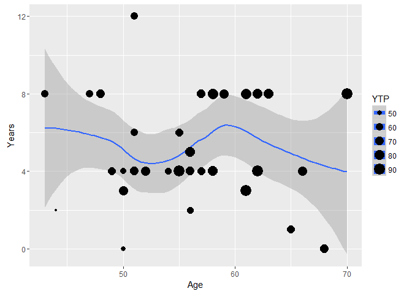

sotu   
============

**sotu**: United States Presidential State of the Union Addresses data
sets scraped from the [American Presidency
Project](http://www.presidency.ucsb.edu) and augmented with demographic
data from
[enchantedlearning.com](http://www.enchantedlearning.com/history/us/pres/list.shtml).

Table of Contents
============

-   [[Data](#data)](#[data](#data))
-   [[Installation](#installation)](#[installation](#installation))
-   [[Contact](#contact)](#[contact](#contact))
-   [[Demonstration](#demonstration)](#[demonstration](#demonstration))
    -   [[Load Packages and Data](#load-packages-and-data)](#[load-packages-and-data](#load-packages-and-data))
    -   [[Life Spans](#life-spans)](#[life-spans](#life-spans))
    -   [[Long or Early Presidency Kills?](#long-or-early-presidency-kills)](#[long-or-early-presidency-kills](#long-or-early-presidency-kills))

Data
============

<table style="width:136%;">
<colgroup>
<col width="43%" />
<col width="20%" />
<col width="72%" />
</colgroup>
<thead>
<tr class="header">
<th align="left">Function</th>
<th align="left">Type</th>
<th align="left">Description</th>
</tr>
</thead>
<tbody>
<tr class="odd">
<td align="left"><code>sotu</code></td>
<td align="left"><code>data.frmae</code></td>
<td align="left">United States Presidential State of the Union Addresses</td>
</tr>
<tr class="even">
<td align="left"><code>sotu_ds</code></td>
<td align="left"><code>list</code></td>
<td align="left"><a href="https://github.com/trinker/hclustext/blob/master/R/data_store.R"><code>data_store</code></a> created from <code>sotu</code> which includes a <code>DocumentTermMatrix</code></td>
</tr>
</tbody>
</table>

Installation
============

To download the development version of **sotu**:

Download the [zip ball](https://github.com/trinker/sotu/zipball/master)
or [tar ball](https://github.com/trinker/sotu/tarball/master),
decompress and run `R CMD INSTALL` on it, or use the **pacman** package
to install the development version:

    if (!require("pacman")) install.packages("pacman")
    pacman::p_load_gh("trinker/sotu")

Contact
=======

You are welcome to:   - submit suggestions and bug-reports at: <https://github.com/trinker/sotu/issues>   - send a pull request on: <https://github.com/trinker/sotu/>  
 compose a friendly e-mail to: <tyler.rinker@gmail.com>

Demonstration
=============

This section demonstrates some analysis that can be conducted with the
data set.

Load Packages and Data
----------------------

    if (!require("pacman")) install.packages("pacman")
    pacman::p_load_gh(
        "trinker/textshape", 
        "trinker/gofastr", 
        "trinker/termco",    
        "trinker/hclustext"
    )
    pacman::p_load(sotu, dplyr, textshape, ggplot2, tidyr, magrittr)

    data(sotu)

Life Spans
----------

Initially, when I started looking at the data set I was interested in
the ages of Presidents. I was amazed at the ages that early presidents
lived too. My wife, Cheryl, suggested I look at this in the context of
when the presidents took office. This plot shows the span from
inauguration (red dot) to death (black dot) as a gray segment. I can't
make any conclusions but it is interesting that many of the mid-section
Presidents took office later and lived shorter.

    sotu %>%
        select(President, Start, Died, Born) %>%
        distinct() %>%
        mutate(
            Years = Died - Born,
            Age = Start - Born
        ) %>%
        mutate(President = factor(President, levels=rev(President))) %>%
        ggplot(aes(y=President)) +
            geom_segment(aes(x = Age, xend = Years, yend = President), size=4, alpha=.3) +
            geom_point(aes(x=Years), size=5) +
            geom_point(aes(x=Age), color="red", size=5) 

Long or Early Presidency Kills?
-------------------------------

Cheryl also suggested that the duration of Presidency may effect the age
a President lives to. Here I investigated the link between inauguration
and death age. I have used a scatterplot and a crude model to
investigate this question. The plot doesn't appear to show any trends.

    sotu %>%
        select(President, Start, Died, End, Born) %>%
        distinct() %>%
        mutate(
            YTP = Died - Born,
            Age = Start - Born,
            Years = End-Start
        ) %>%
        group_by(President) %>%
        summarize(YTP = min(YTP), Age = min(Age), Years=sum(Years)) %>%
        ggplot(aes(Age, Years, size=YTP)) +
            geom_smooth() +
            geom_point() 

Interestingly, the linear model indicates tat the inaugural age of the
President has a significant positive effect on death age. Years of
presidency has a non-significant negative effect on death age.

    sotu %>%
        select(President, Start, Died, End, Born) %>%
        distinct() %>%
        mutate(
            YTP = Died - Born,
            Age = Start - Born,
            Years = End-Start
        ) %>%
        group_by(President) %>%
        summarize(YTP = min(YTP), Age = min(Age), Years=sum(Years)) %>%
        with(lm(Age ~ YTP + Years)) %T>% 
            {print(summary(.))} %>%
            anova()

    ## 
    ## Call:
    ## lm(formula = Age ~ YTP + Years)
    ## 
    ## Residuals:
    ##     Min      1Q  Median      3Q     Max 
    ## -7.8933 -4.0459 -0.4126  3.0651 10.9507 
    ## 
    ## Coefficients:
    ##             Estimate Std. Error t value Pr(>|t|)    
    ## (Intercept) 33.62984    4.85286   6.930 4.71e-08 ***
    ## YTP          0.34440    0.06969   4.942 1.91e-05 ***
    ## Years       -0.46815    0.31464  -1.488    0.146    
    ## ---
    ## Signif. codes:  0 '***' 0.001 '**' 0.01 '*' 0.05 '.' 0.1 ' ' 1
    ## 
    ## Residual standard error: 4.949 on 35 degrees of freedom
    ##   (5 observations deleted due to missingness)
    ## Multiple R-squared:  0.4115, Adjusted R-squared:  0.3779 
    ## F-statistic: 12.24 on 2 and 35 DF,  p-value: 9.342e-05

    ## Analysis of Variance Table
    ## 
    ## Response: Age
    ##           Df Sum Sq Mean Sq F value    Pr(>F)    
    ## YTP        1 545.28  545.28 22.2606 3.748e-05 ***
    ## Years      1  54.23   54.23  2.2137    0.1457    
    ## Residuals 35 857.34   24.50                      
    ## ---
    ## Signif. codes:  0 '***' 0.001 '**' 0.01 '*' 0.05 '.' 0.1 ' ' 1